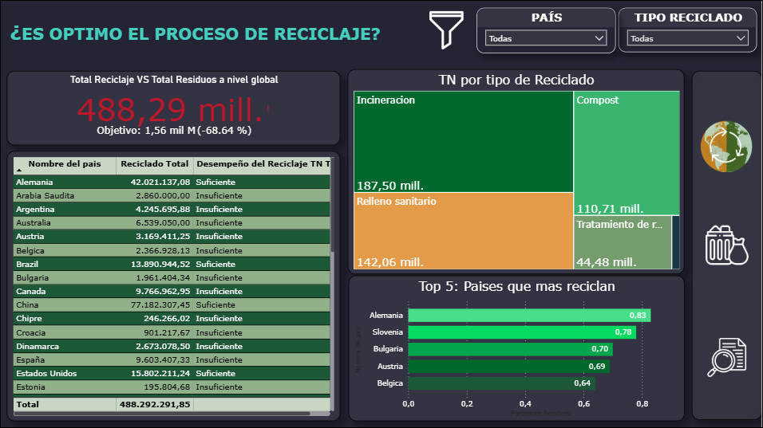
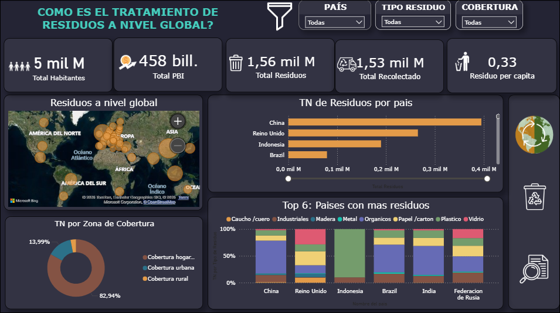

# Global Recycling Data Analytics Dashboard

Business Intelligence project analysing global waste generation and recycling across major economies.

## Tools
- Power BI
- SQL
- Data Modeling
- DAX
- Data Visualization

## Project Overview

This project analyses how major global economies manage waste generation and recycling.

The dashboard provides insights into:
- Waste generation by country
- Recycling performance
- Waste types distribution
- Environmental indicators

## Dashboard Preview

## 🌍 Interactive Dashboard in Power BI

You can see the full dashboard here:

👉 [See Dashboard in Power BI](https://app.powerbi.com/view?r=eyJrIjoiODZjNjQ1YmMtYWE2Mi00ZGFiLTk3ZjUtOGI4MzRiMzc3MWQ3IiwidCI6IjRjODE4Zjc5LWFiODQtNDU1Mi05YjdjLTJmZTcxNWIwZDBkNSIsImMiOjR9)

## Data Sources

Global waste management datasets used for sustainability analysis.

## Documentation

Full project documentation:

documentation/Proyecto final Residuos Y Reciclaje 13-04-22.pdf
